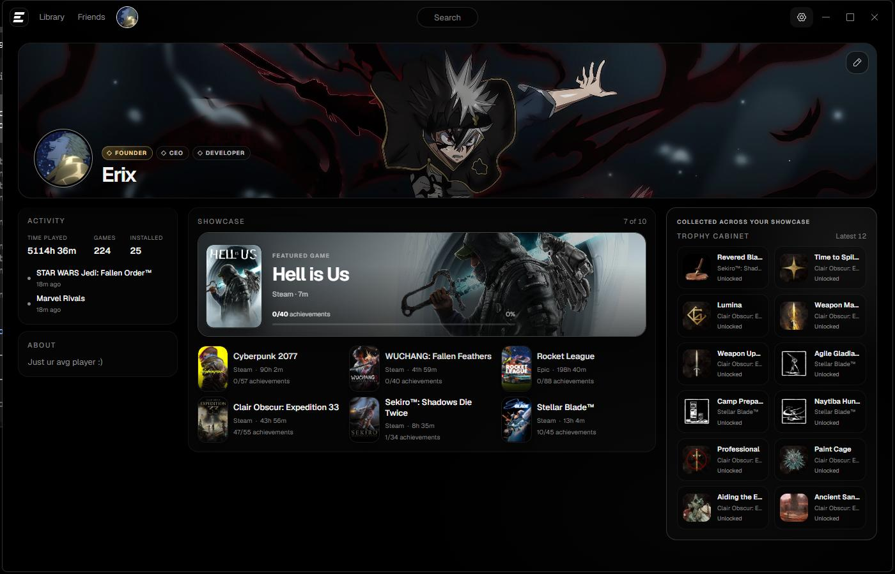

<p align="center">
  
</p>

<h1 align="center">Exo Launcher</h1>

<p align="center"><strong>One home. The other clients stay out of the way.</strong></p>

<p align="center">
  Install, update, and play Steam, Epic, GOG, Riot, and portable Windows games from one AMOLED library. Buy in a browser if you must. The store windows are not the app.
</p>

<p align="center"><strong>Version 2.0.3</strong> · Friend profiles, installable Minecraft/Roblox, and every launcher in Settings.</p>

<p align="center">
  <a href="https://github.com/ImAvgErix/ExoLauncher/releases/latest"></a>
  <a href="https://github.com/ImAvgErix/ExoLauncher/releases/latest"></a>
  <a href="LICENSE"></a>
</p>

<p align="center">
  <a href="https://github.com/ImAvgErix/ExoLauncher/releases/latest/download/ExoLauncher-Setup.exe"><strong>Download for Windows 11</strong></a>
  ·
  <a href="https://github.com/ImAvgErix/ExoLauncher/issues">Report an issue</a>
  ·
  <a href="https://www.buymeacoffee.com/UhhErix">Support development</a>
</p>

<p align="center">
  
</p>

## What’s new in 2.0

- **Real Exo identity** — remote email/password accounts, reserved handles, expressive profiles, uploaded avatars/banners/GIFs, privacy controls, direct friends, blocking, badges, and friends-only presence.
- **Truthful ownership** — linked store identities are exclusive to one Exo profile; revoked/refunded games become **Buy again** and unavailable provider data never becomes false offline or false ownership.
- **Artwork and achievements that recover** — high-resolution cover/banner pipelines, local replace/refetch/report controls, account-scoped Steam/Epic achievements, honest unavailable states, and secure cached artwork.
- **Safer upscalers** — signed NVIDIA/AMD/Intel validation, semantic newest selection, official-source preference, persistent status/catalog caches, and guarded restore.
- **Less waiting and less clutter** — virtualized large libraries, eager first-screen art, cached game tools, compact search, a 112px active Now dock, and no permanent recent-game hero.
- **Production social backend** — Cloudflare Worker, D1, R2, and per-user Durable Object presence with strict privacy and rate limits. Local library and launching remain complete while signed out or offline.

Google sign-in and email magic links are not enabled without real provider credentials. Email/password account creation is live.

## What it does

Home uses a compact Now dock only while a game is playing, transferring, or awaiting an update, followed by pinned titles and the installed library. Open a game and the action is **Play**, **Install**, or **Update**. Progress lives in Exo. Steam, Epic, GOG, and Riot stay installed where their vendors put them — Exo commands those clients and keeps their chrome hidden.

An Exo account is optional. You can create one with an email address and a 12–128-character password. Email verification and password recovery are not available yet. Signed out or offline, the library, install, update, launch, and local settings paths still work. There are no ads, tray agent, or analytics.

<p align="center">
  
</p>

- **Now** — a compact active-state dock for downloading, playing, or updates. Recent-only state does not reserve space.
- **Pinned + library** — covers and store names. Open a tile for the 400px plate. Home does not jump.
- **Local artwork controls** — replace, reset, or refetch a library title's cover from its game page. Picked PNG/JPEG covers are validated and copied into Exo; grouped store variants share the same local override.
- **Exact store actions** — Steam install/update/uninstall goes through `ExoLauncher.SteamIpc` (`steamclient64.dll`). Epic uses Legendary. GOG uses gogdl. Riot uses the official patch API.
- **Honest stores** — Xbox, EA app, Ubisoft Connect, Battle.net, Amazon Games, and Rockstar list and launch proven installs. No fake catalogs.
- **Progress in Exo** — percent when Steam’s live job is moving, indeterminate until then. Cancel stays on the game.
- **Achievements** — Steam and Epic unlocks can surface in Exo with real art. Other stores are not reported as zero.
- **Upscalers** — optional, user-requested swap of DLSS / FSR / XeSS files the game already ships. Refused on anti-cheat titles. Originals stay as `.exo-bak`.
- **Optional online modules** — implemented reserved handles, privacy-controlled profile/media, friend requests, verified store links, mutual Steam discovery, fixed server-managed profile badges, and friend presence. No chat. Signed out or offline remains a complete local launcher; unavailable presence stays unknown, never fabricated offline.

<p align="center">
  
</p>

<p align="center">
  
</p>

## Store reality

Exo is a library UI. It is not a DRM, ownership, or anti-cheat bypass.

- Steam, Epic, GOG, and Riot own login, licenses, downloads, and anti-cheat. Exo does not copy those trees into itself.
- Anti-cheat processes are never killed (`vgk` / `vgc`, EAC, BattlEye).
- Optional helpers (Legendary, gogdl) are used only for supported actions. See [vendor notes](docs/VENDORS.md).

## Install

1. Download **[ExoLauncher-Setup.exe](https://github.com/ImAvgErix/ExoLauncher/releases/latest/download/ExoLauncher-Setup.exe)**.
2. Run it. Exo installs per-user under `%LOCALAPPDATA%\ExoLauncher\app`.
3. Open Exo and let it find the clients already on the PC.

**Requirement:** Windows 11 x64.

The installer is not code-signed, so SmartScreen may ask. GitHub publishes a SHA-256 digest next to the asset.

## Local-first

Settings, covers, library data, machine paths, and historical playtime stay on the PC. Signed-in identity/social actions run only after sign-in; public profile, search, and share reads may contact exo-id while signed out. None sits in front of library, install, update, or launch. While signed in with Launcher open, presence connects and may share the current game id/title with connected friends under activity privacy. Verified Epic/GOG linking sends the existing store access token once to exo-id for verification; the service discards it after the store lookup. Full statement: [PRIVACY.md](PRIVACY.md).

The optional Worker is documented in [services/exo-id/README.md](services/exo-id/README.md). Email/password accounts use Better Auth's Scrypt password hashing; only the resulting bearer session is retained by the native app in DPAPI-protected storage. Google remains gated by OAuth credentials, and email magic-link by real mail delivery. The password revision is deployed and production-smoke-tested with disposable accounts that were removed afterward.

## Build from source

WinUI 3 · .NET 10.

```powershell
dotnet test ExoLauncher.sln -c Debug -p:Platform=x64
pwsh -File Run-ExoLauncher.ps1
```

## Family

[Exo](https://github.com/ImAvgErix/ExoHub) · [Exo OS](https://github.com/ImAvgErix/ExoOS) · [Exo Control](https://github.com/ImAvgErix/ExoControl)

Changelog: [CHANGELOG.md](CHANGELOG.md).

## License

MIT © 2026 Erix ([ImAvgErix](https://github.com/ImAvgErix))
