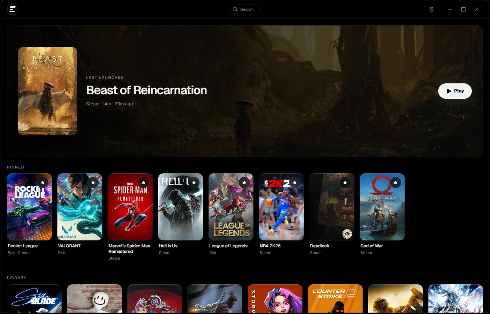
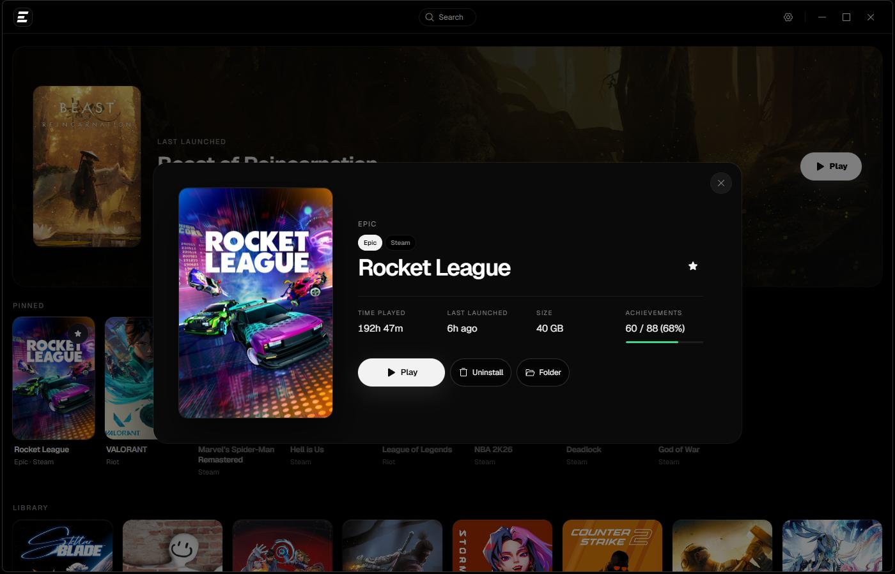
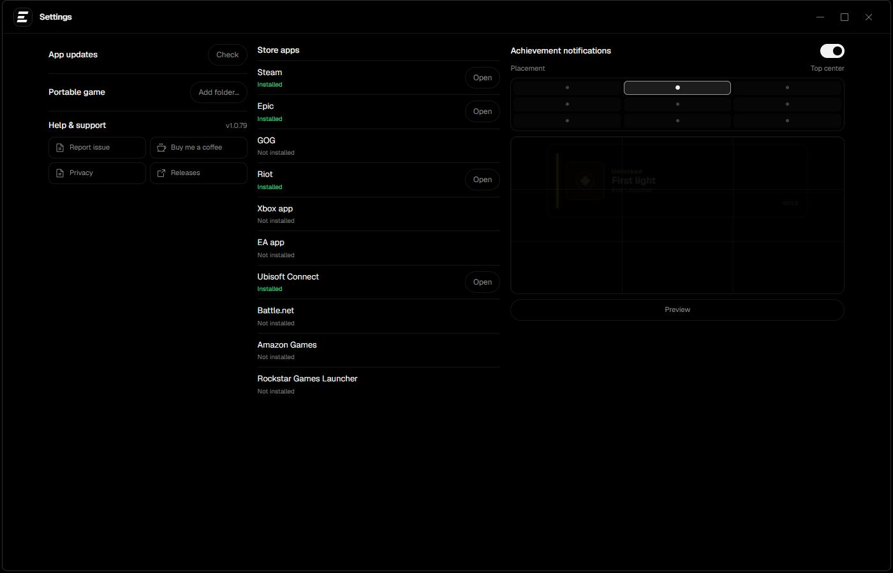

<p align="center">
  
</p>

<h1 align="center">Exo Launcher</h1>

<p align="center"><strong>One home. The other clients stay out of the way.</strong></p>

<p align="center">
  Install, update, and play Steam, Epic, GOG, Riot, and portable Windows games from one AMOLED library. Buy in a browser if you must. The store windows are not the app.
</p>

<p align="center">
  <a href="https://github.com/ImAvgErix/ExoLauncher/releases/latest"></a>
  <a href="https://github.com/ImAvgErix/ExoLauncher/releases/latest"></a>
  <a href="LICENSE"></a>
</p>

<p align="center">
  <a href="https://github.com/ImAvgErix/ExoLauncher/releases/latest/download/ExoLauncher-Setup.exe"><strong>Download for Windows 11</strong></a>
  ·
  <a href="https://github.com/ImAvgErix/ExoLauncher/issues">Report an issue</a>
  ·
  <a href="https://www.buymeacoffee.com/UhhErix">Support development</a>
</p>

<p align="center">
  
</p>

## What it does

Home is one Now plate, pinned titles, and the installed library. Open a game and the action is **Play**, **Install**, or **Update**. Progress lives in Exo. Steam, Epic, GOG, and Riot stay installed where their vendors put them — Exo commands those clients and keeps their chrome hidden.

There is no Exo account, ads, tray agent, or analytics.

<p align="center">
  
</p>

- **Now** — one featured title: downloading, playing, an update, or last launched. Wide Steam hero art when it exists.
- **Pinned + library** — covers and store names. Open a tile; Close details fades. Home does not jump.
- **Exact store actions** — Steam install/update/uninstall goes through `ExoLauncher.SteamIpc` (`steamclient64.dll`). Epic uses Legendary. GOG uses gogdl. Riot uses the official patch API.
- **Honest stores** — Xbox, EA app, Ubisoft Connect, Battle.net, Amazon Games, and Rockstar list and launch proven installs. No fake catalogs.
- **Progress in Exo** — percent when Steam’s live job is moving, indeterminate until then. Cancel stays on the game.
- **Achievements** — Steam and Epic unlocks can surface in Exo with real art. Other stores are not reported as zero.

<p align="center">
  
</p>

## Store reality

Exo is a library UI. It is not a DRM, ownership, or anti-cheat bypass.

- Steam, Epic, GOG, and Riot own login, licenses, downloads, and anti-cheat. Exo does not copy those trees into itself.
- Anti-cheat processes are never killed (`vgk` / `vgc`, EAC, BattlEye).
- Optional helpers (Legendary, gogdl) are used only for supported actions. See [vendor notes](docs/VENDORS.md).

## Install

1. Download **[ExoLauncher-Setup.exe](https://github.com/ImAvgErix/ExoLauncher/releases/latest/download/ExoLauncher-Setup.exe)**.
2. Run it. Exo installs per-user under `%LOCALAPPDATA%\ExoLauncher\app`.
3. Open Exo and let it find the clients already on the PC.

**Requirement:** Windows 11 x64.

The installer is not code-signed, so SmartScreen may ask. GitHub publishes a SHA-256 digest next to the asset.

## Local-first

Settings, covers, and library cache stay on the PC. Exo does not upload store credentials, paths, friends, or play telemetry to an Exo service. Full statement: [PRIVACY.md](PRIVACY.md).

## Build from source

WinUI 3 · .NET 10 · React · WebView2.

```powershell
npm --prefix ui ci
npm --prefix ui run build
dotnet test ExoLauncher.sln -c Debug -p:Platform=x64
pwsh -File Run-ExoLauncher.ps1
```

## Family

[Exo](https://github.com/ImAvgErix/ExoHub) · [Exo OS](https://github.com/ImAvgErix/ExoOS) · [Exo Control](https://github.com/ImAvgErix/ExoControl)

Changelog: [CHANGELOG.md](CHANGELOG.md).

## License

MIT © 2026 Erix ([ImAvgErix](https://github.com/ImAvgErix))
