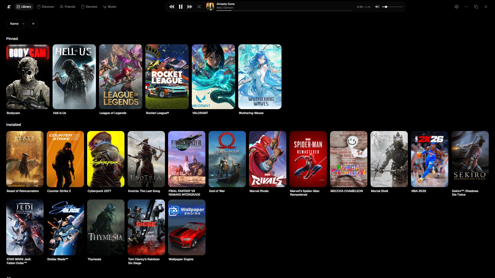
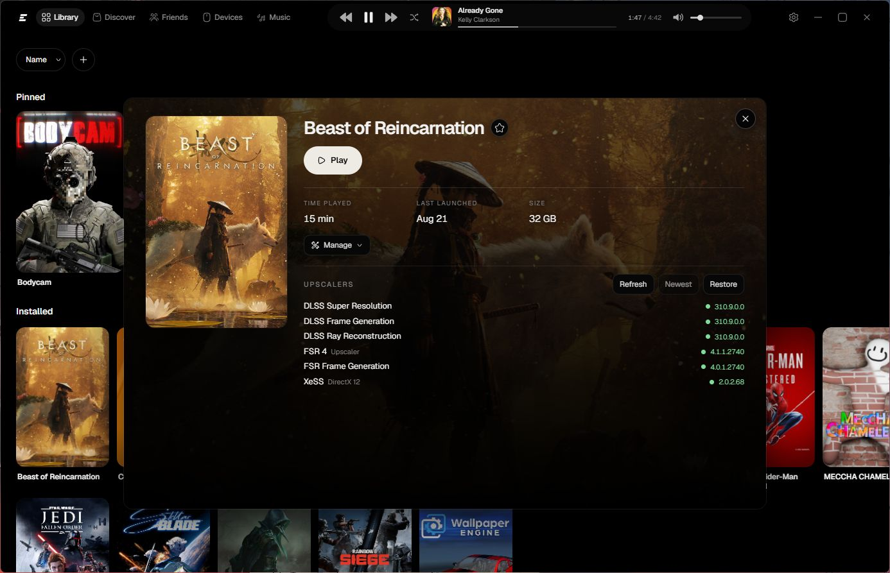
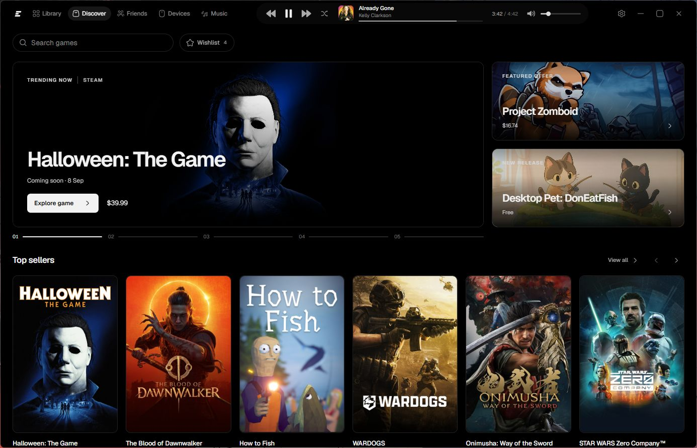
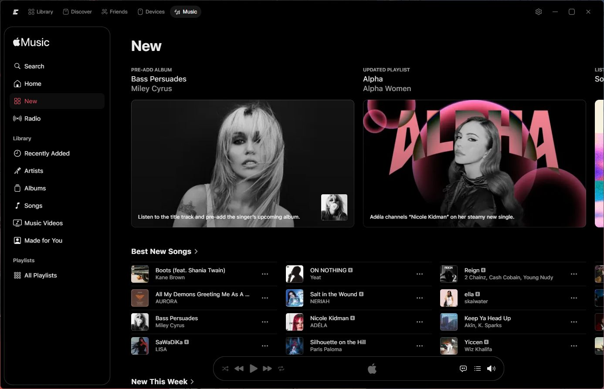
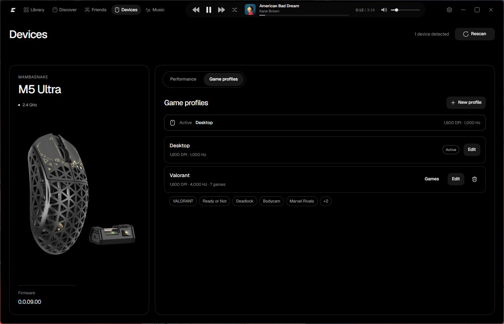
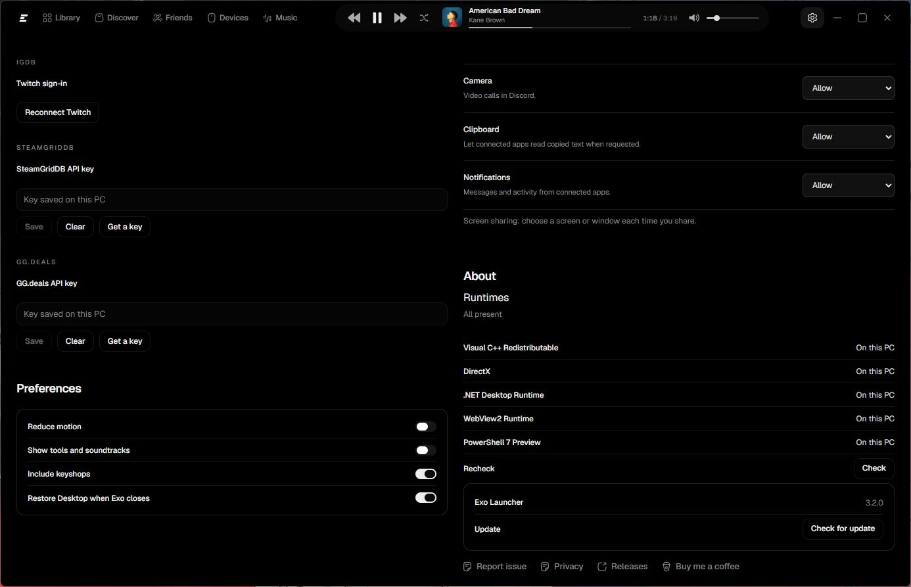

# A look around Exo Launcher 3.2

Screenshots from the Windows app. Artwork, catalogs, and available controls depend on your library, services, and connected hardware. Personal account details are hidden in the Music screenshot.

## Library

Keep your games together, pin your favorites, and choose what to play.

## Game details

Open a game to see its artwork, information, and available actions.

## Discover

Browse categories and offers, search for games, and return to where you left off.

## Music

Apple Music is shown here. You can also choose Spotify or YouTube Music. Your service handles its own account and subscription.

## Devices

Save profiles for games and your desktop. This example shows the game-profile view for a MAMBASNAKE M5 Ultra. Available controls depend on your model and connection.

## Settings

Manage your preferences, embedded-service permissions, and updates. The About section shows your installed version.

[Download Exo for Windows 11](https://github.com/ImAvgErix/ExoLauncher/releases/latest) · [Getting started and help](HELP.md) · [Back to Exo](../README.md)
